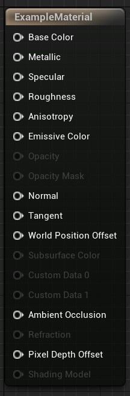

# Unreal Engine 5: Material Lessons

## Material Instances

I've been watching an interesting and well-done series on YouTube by *[Unreal Sensai](https://www.youtube.com/c/UnrealSensei)* called "[Unreal Engine 5 Beginner Tutorial - UE5 Starter Course 2022](https://youtu.be/k-zMkzmduqI)" and just stumbled across an idea. So called ["Material Instances" (1:02:31)](https://www.youtube.com/watch?v=k-zMkzmduqI&list=WL&index=1&t=3751s) enable you to make materials and edit them more rapidly than the "change-apply" pattern, which takes time to rebuild each time.

At first glance, this reminds me of a function that's been extracted for convenience. You can make specific values, e.g., multipliers, a parameter of the material instance, which lets you change its value on-the-fly without needing to change-and-apply every time. The obvious value here is to make the material massively scalable (no pun intended) and easy to change quickly.

Alternatively, rather than a function, a class might be a more appropriate analogy. For one, much of the "blueprint" approach of UE (Unreal Engine) scenes abstracts the code-writing parts to a UI. (I might "borrow" this idea for some of my own projects.) Secondly, the name is a dead giveaway: material *instance.* The specifics of the material are abstracted to a class, a reusable pattern, and can be instantiated.

## Master Materials

A "[Mater Material](https://www.youtube.com/watch?v=k-zMkzmduqI&t=4141s)" can be made to act as a base material so that configuring textures, colors, normal maps, etc… is done in one place. Material Instances are then created *from* the Master Material and a lot of boilerplate time is saved. This is basically an abstracted base class from which multiple other classes inherit. It's a clever way to save time and use the same set of tools for all your materials.

He also mentioned a clever hack that UE developers use where [the RGB channels are highjacked for their 3-dimensionality](https://youtu.be/k-zMkzmduqI?t=4862). Then, things like texture, normals, roughness, specular, etc masks can be "baked" into one image. That image is used in conjunction with the separate RGB pins, which are individually connected to the respective material inputs. ([See UE5's documentation on Texture Masks > "Material Masking"](https://docs.unrealengine.com/5.0/en-US/using-texture-masks-in-unreal-engine/#materialmasking).)

<!-- TODO might want to handle styles differently for images -->

For example, the red channel might have the metallic mask, so the red output should connect to the metallic input of the mesh. The blue channel could hold the roughness mask, so blue output connects to roughness input, and the green may have the normal mask, so green output to normal input. The video makes this sound like a very common practice. It is similar to image sprites, but instead of the 2 dimensions (x & y coordinates) of sprites, the 3 dimensions of RGB are used. Hypothetically, you could thrown in a 4th dimension using alpha. The prime caveat, at first glance, would be communicating these points to the relevant developers. It is not intuitively clear which channels are chosen to represent which values, so mappings would be communicated  by in-house convention or documented values. Maybe there's a common practice (e.g. always go in the order of the UI for the material, so input 1 is would be red, input 2, green, etc…).

