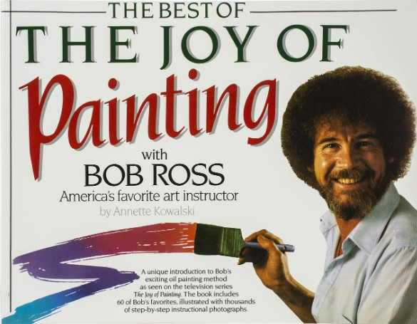

In an effort to try and categorize the sometimes nebulous and ever-shifting definition of creative works, I've developed a three-part framework for considering creative works. This series is designed to help me **test my assumptions and the utility of the framework** in a variety of creative disciplines.

It will begin by being applied to more traditional forms of creativity like painting, music, and writing. As the framework is tested and refined, more examples will be considered in less-traditional fields of creativity (e.g. software development, entrepreneurship, or science).

## The Framework

The framework is composed of three parts: craft, design, and art. Much like Aristotle's various frameworks, e.g. [the four causes](https://plato.stanford.edu/entries/aristotle-causality/) or [modes of persuasion](https://plato.stanford.edu/entries/aristotle-rhetoric/), this framework's goal is to provide a multifaceted way to look at creative works in a holistic manner.

> This framework's goal is to provide a multifaceted way to look at creative works in a holistic manner.

Here is the initial framework:

- **craft**: the process of how to make something given certain materials or processes
- **design**: the process of organizing the components of the work in an aesthetically pleasing manner
- **art**: the process of imbuing the work with meaning, purpose, and/or value

### Craft

**The process of how to make something given certain materials or processes.**

The combo of "arts and crafts" conjures mental images of Hobby Lobby and Jo-Ann Fabrics. A looser definition of the term "art" will include some paintings for sale, and several books on Bob Ross _plein air_ painting instruction books.

However, I'm proposing this only scratches (pun intended) at the craft of creative works. It deals with the _how-to_ of painting, drawing, sculpting, and modeling.

This is not derisive towards craft. It is an essential part of generating creative work. Without the craft, there is nothing to observe.

Painters need to know how to mix paint. Musicians need to know how to finger their instrument. Writers need to know how to write legibly and occasionally rhyme words in a poem. Technical implementation details in _how something is made_ are quite important.

### Design

**The process of organizing the components of the work in an aesthetically pleasing manner.**

Given craft works out the technical details of _making_ some creative work, design is what makes it appealing and pleasurable to observe. How are the essential parts organized to make the work enjoyable? What does that mean?

In visual creative works, strong design means the visual components, shapes, and elements are composed in an appealing way. Their placement in the layout of the composition is intentional and facilitates what the creator intended. Scale can be used to indicate relative size to other elements or relative size to the observer. Color theory may be used to indicate mood, relationships of elements; red can be used to anger _and_ love.

In musical works, melody, harmony, and rhythm can create coherent and aesthetically pleasing songs. The way elements or instruments of the song interact with each other can create pleasing or dissonant combinations, which might reflect and underlying story appealingly. (Note that "aesthetically pleasing" might seem unattractive on its own, but the elements might contrast other elements in appeasing ways.)

\# TODO find example of appealing elements in a song that have been "well-designed"

Similarly, written works will use elements of the story like plot structure to reflect the theme of narrative being explored. Character development can be heart-wrenching and bittersweet or empowering and dynamic, all drawing the reader in to the story with attractive nuances. Narrative styles like mystery novels that build suspense and exciting clues at just the right time are well-designed stories.

For example, the building mystery and details grown throughout the narratives of stories like _Gone Girl_, _The Da Vinci Code_, and _The Silence of the Lambs_. Each story designs the reveal of details and twists-and-turns to keep drawing the reader in.

### Art

**The process of imbuing the work with meaning, purpose, and/or value.**

So if craft is _how something is made_, and design is _how something is organized_ for aesthetic appeal, what is art? I fully expect this to be the main point of contention for those considering this framework. Or asked another way, **what makes something art?**

When a creative work has symbolism and meaning _breathed_ into the work to enable it to be something more than its _prima facie_ portrayal, it becomes art. An Annunciation painting of Gabriel and Mary might just be an illustration of a biblical scene. However, once the elements are added in their rich symbolism, the painting becomes more art than illustration.

The flower being the Word given to Mary, in Gabriel's hand means she has not yet been impregnated, or in her hand, she is with child (and the variations in between). This rich symbolism and meaning speaks to a deeper story being told in the painting.

Beethoven's 5th Symphony and its legendary motif used in the beginning of the song (and throughout): bum bum bum buuuum. The "Fate knocking at the door" motif "a large-scale narrative of victory and defeat, of the eternal human struggle with fate, of sorrow and redemption" (Source: [Warning Classics](https://www.warnerclassics.com/release/beethoven-symphony-no-5-fate-knocking-door))

In literature, complex themes might provide metaphors for real-world instances of abstract concepts shared in the story. George Orwell's _1984_ uses "Big Brother" as a symbol of oppressive, totalitarian, and surveillance. Thought-provoking themes in literature don't just challenge the reader to consider the proposed ideas, but also to put one's self in the position and ask, "How would I respond?"

## Future Exploration

As mentioned earlier, this post is only introducing the three-part framework I've outlined here. Future posts will explore more instances of how this framework applies to other creatives works and how versatile it can be.

The shortcomings and challenges of the framework will also be considered. Particularly, what instances do not fit so nicely within this framework and why? How does culture affect the framework, or how do varying interpretations apply to what makes a creative work "art?"

Links will be provided to this post as more content becomes available.

Thank you so much for reading!
