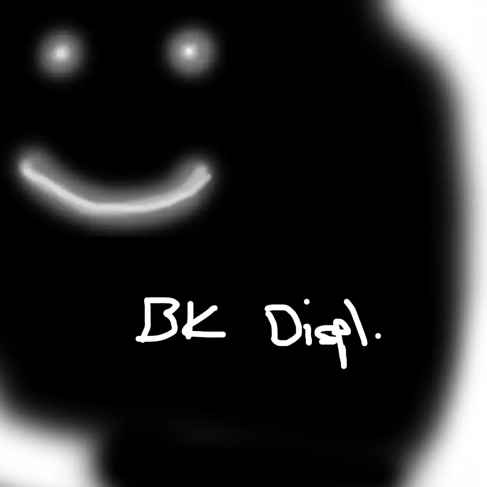
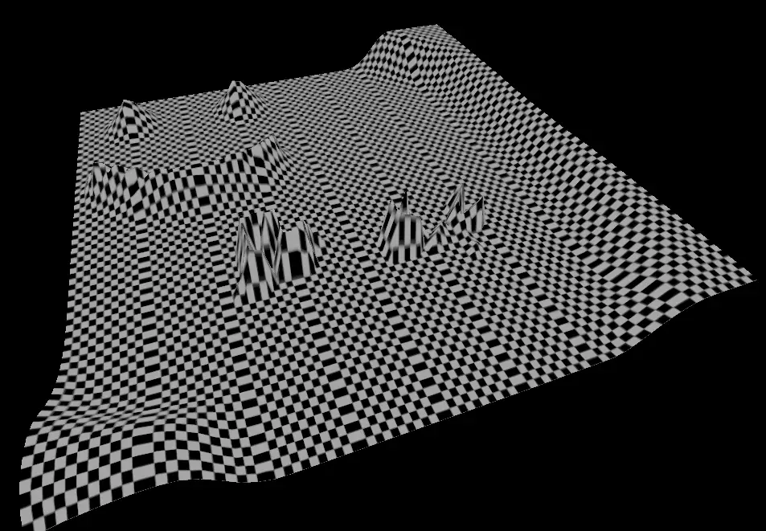
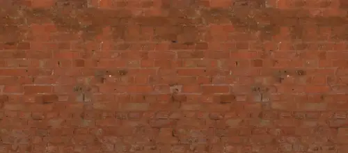
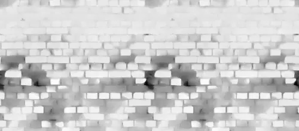

# Three.js Learning: Displacement Maps

I've been learning Three.js more in-depth the past couple of weeks. It's been a long-held desire to get into the weeds, and I finally pulled the trigger. (Shout out to [Bruno Simon](https://x.com/bruno_simon)'s amazing [Three.js Journey](https://threejs-journey.com/)!)

One concept I've been playing with to understand it better is displacement maps. I specifically wondered how I might shape terrain just by painting an image in real time. While I'm lacking the "real time" shaping (though it's not hard to see how I'd handle it), the painting part came together easily.

## What Are Displacement Maps?

> The displacement map affects the position of the mesh's vertices. Unlike other maps which only affect the light and shade of the material the displaced vertices can cast shadows, block other objects, and otherwise act as real geometry. The displacement texture is an image where the value of each pixel (white being the highest) is mapped against, and repositions, the vertices of the mesh. - [Three.js Docs](https://threejs.org/docs/?q=plane#api/en/materials/MeshStandardMaterial.displacementMap)

A displacement map is a black-and-white image that affects the mesh vertices. White is up, black is down, and the amount of "up" is determined by the [`displacementScale` property](https://threejs.org/docs/?q=plane#api/en/materials/MeshStandardMaterial.displacementScale).

This means terrain can be "built" from a plane with enough triangles and a good displacement map.

## My Play Examples

To get a sense of how this works and how easily it can be manipulated, I opened a photo editor and started painting.



This goofy smiley is then applied to the scene's plane mesh and we get an equally goofy shape!

```ts
const textureLoader = new THREE.TextureLoader();
const checkerTexture = textureLoader.load('/checkers.jpg');
const displacementMap = textureLoader.load('/displacement-map.webp');
const bumpMap = textureLoader.load('/bump-map.webp');
// tiling requires some manual configuration; womp womp
checkerTexture.repeat.set(8, 8);
checkerTexture.wrapS = THREE.RepeatWrapping;
checkerTexture.wrapT = THREE.RepeatWrapping;

const planeGeometry = new THREE.PlaneGeometry(10, 10, 50, 50);
const planeMaterial = new THREE.MeshStandardMaterial({
    color: 'white',
    map: checkerTexture,
    bumpMap,
    displacementMap,
    displacementScale: 1,
});

const plane = new THREE.Mesh(planeGeometry, planeMaterial);
plane.rotation.x = -Math.PI / 2;
scene.add(plane);
```



I also noticed my checker pattern is one column off from tiling correctly - whoops! (That's why some rows have extra wide blocks that make the whole tiled texture look columnated.)

(Also, note to self: if Three.js examples become more common on my site, I'd like to have live interactive demo code.)

Notice also the "BK Displ." written text on the displacement map and how it translates to the mesh from the screenshot. It's not immediately clear that's what's written on the map. That's because the poly count is not high enough, and perhaps the resolution of the map is too low. More tinkering would reveal which/both.

## More Common Examples

Displacement maps (and bump maps, which are much smaller, i.e. for bumps) usually align with their color textures. For example, this brick texture…



… should be used with this brick displacement map.



([Brick example taken from Poly Haven](https://polyhaven.com/a/broken_brick_wall). [Props to Amal Kumar](https://polyhaven.com/all?a=Amal%20Kumar))

## Wrap It Up, Chatty

Whether you're adding extra detail to a scene/texture or literally shaping the scene's environment and landscape, displacement maps are an awesome tool in the tool belt. Learn its powers well, and the quality of your scenes will improve accordingly.

Happy learning, all!