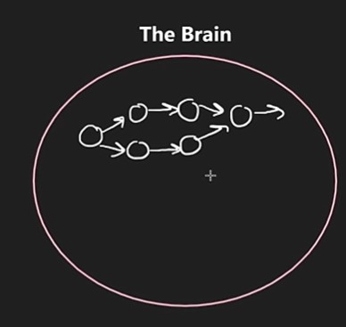

# Learning Theory Response

In a [posted short](https://www.youtube.com/shorts/Ip59tQ7lIBI) by [NeetCodeIO](https://www.youtube.com/@NeetCodeIO/shorts), Navi explains his theory on how to learn faster. (I'll ignore my semantic squabble aside regarding his use of "theory"). He explains that, as people learn, their brains create connections that enable them to perform some skill faster in the future. He refers to the learned skill as "building a circuit."

Navi goes on to explain how building that "circuit" takes time, and once its successfully built, it can be accessed pretty quickly.

## Inputs

When we learn things, our brain stores the stimuli in fragments around the brain. This is why a sense (smell, sound, etc.) can trigger such vivid memories: the senses were experienced at the same time. (Or enough other similar senses link to each other and trigger combinations of memories otherwise unrelated.)

The more inputs exist for certain learned skills, the easier it is to access those memories and learned skills. If Navi spent hours grinding LeetCode questions dealing with BFS (Breadth First Search), he has many stimuli linked to similar problems that are solved by BFS. It's the hours of grinding that build the "circuit," as Navi says.

Other factors play a role in how easily this skill is accessed, e.g., the timing between exercising the skill/memory to problem solve algorithmic problems like this.

Like roads into a city (or to Rome), the more inputs, on-ramps, or pathways to the skill/memory, the easier it is to access and use.

## Outputs

This means the more something is practiced, the easier it becomes. "Duh, Adam," I know, but this explains *why* the statement is accurate. Developers with years of experience can call upon that wealth of experience to solve similar future problems, and as the Jewish sage wisdom of Ecclesiastes teaches us, "there's nothing new under the sun."

This is applicable to all skills. Learning new programming languages, or spoken languages, solving LeetCode (or NeetCode) problems, solving business logic and architecture problems, dealing with difficult people, learning to draw with excellent perspective and shading, playing an instrument (arguably akin to speaking another language in some ways), etc. all benefit from this process. More exposure, more learning, easier access.

So if you want to master something, or at least become passably proficient at it, immerse yourself in the content and scenarios where it naturally occurs. Do so in many different settings too. Skills often map to other subjects. These "far transfers" of knowledge/skill strengthen your command over them.

Practice often, understand deeply, apply broadly, master incrementally.
