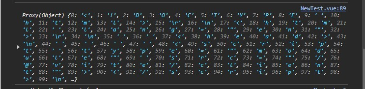

# Mock Service Worker Reminder

I've been using Mock Service Worker (MSW) for a couple of years now, and it's really been a game-changer. I love not worrying about mocking implementations of services and mocking the API response instead. It's brilliant.

## The Issue

I frequently find myself having a similar problem though, which is entirely on my end. I keep getting requests returning my markup instead of the desired JSON data. That obviously causes bad requests or handling of data. For example…

<figure>
    
    
    <figcaption>Example JSON Parse Result<figcaption>
</figure>

## The Solution

The source of my problem relatively simple: **I'm making requests too soon.**

My current setup is to call `worker.start()` inside of a helper function that only optionally loads the MSW resources. This helps keep my production bundle size smaller. There is also a way to wait for the service worker to finish loading so that my particular problem doesn't happen.

[Kent C. Dodds had this issue addressed in Issue 73](https://github.com/mswjs/msw/issues/73), which reminded me of how to wait for the workers to be ready. Specifically, [@kettanaito](https://github.com/kettanaito)'s [answer](https://github.com/mswjs/msw/issues/73#issuecomment-601584127) shows that the `start()` method is async and needs to be `await`ed in order for requests to follow correctly. Of course!

I then found my most recent troublemaker in this instance of the problem. I was overly ambitious in making one of my modules (which makes the problem request) fetching data too early. It looks something like this:

```ts
import { computed } from 'vue';
import { getConfig } from './getConfig';

// 👇 the line that's calling too early
const config = getConfig(); // Promise<Config> where Config is a reactive Vue object

const origin = computed(() => config?.someOrigin ?? '');
const link = computed(() => `${origin.value}/${endpoint}`);

export function useLink() {
    // … some caching logic for the config to only need to fetch it once…

    return link;
};
```

The solution ended up being simple this time. I just needed to move the initial fetch of the config to the `useLink()` composable so that it would be called after MSW's load finishes.

```ts
import { computed } from 'vue';
import { getConfig } from './getConfig';

// 👇 the line that's calling too early
const { config, execute } = getConfig(); // refactored as a composable to return the reactive config, which will be updated once execute() finishes

const origin = computed(() => config?.someOrigin ?? '');
const link = computed(() => `${origin.value}/${endpoint}`);

export function useLink() {
    // … some caching logic for the config to only need to fetch it once…
    
    execute(); // just letting this resolve behind the scenes; the 
    return link;
};
```

Admittedly, I chopped up my original code somewhat to preserve private code, but this is the essence of the situation. Using a combo of reactivity and making calls at the right time, I could refactor to allow MSW to finish loading, which then allows the mocked config request to be handled by MSW.

**The takeaway**: don't make requests before they're ready to be handled in MSW.

## Acknowledgement

I know this is a dev-setup issue and isn't likely to be relevant in production or even dev-server testing (i.e. non-localhost). The API from which I fetch the config will already be up and running, so this is a moot issue regarding that.

However, I use MSW a **lot**, and it's great to remember with clarity why I've run into this issue in the past. Hopefully by writing this post, I'll remind myself and/or cement the knowledge in memory better.

Hope this helps, dear anonymous reader!