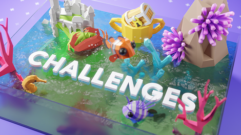
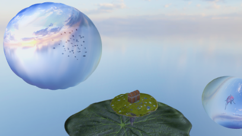

# Three.js Journey August '25 Challenge: Aquarium

I began the Three.js Journey course in May 2025. June 2025 presented the 'castle' challenge, but I was a bit unprepared and didn't appreciate the value of stating focused on an MVP (minimum viable "project" in this case).

This second challenge I'll attempt, I have been keeping my focus on the basics.

## The Aquarium

<a href="https://threejs-journey.com/challenges/019-aquarium" target="_blank">
#019 Aquarium

</a>

The theme is "aquarium." I bounced around to several ideas initially, as is the nature of creative brainstorming. One Saturday morning, when at some family's house on the lake, my boys and I were surfing Pinterest. It has a great selection of wild, awesome concept art, impossible scenes, and surreal inspirations.

What we discovered was in that vein of surrealism and fantastic. We saw whales and fish in cubes of water swimming through the air. We began dreaming up cool scenes and visual components.

## Surreal Aquarium

The "final" project became a goofy, fun, [surreal aquarium](https://tjsj-aquarium.web.app/).

Here's how the project *developed*. 😉

### Cubes and Spheres

Upon implementing a cube, I discovered what's apparently a common issue: Three.js cubes are composed of 6 planes which have different vertexes along the edge. When I began animating the faces of the cube using a sin wave, the edges never stayed together. Womp womp.

Once I learned (with some help from our chatty robot friends at Grok and Gemini) that 6-faced issue with cubes, I shifted to using a sphere, which conceptually made better sense anyway.

Adding the sin wave to the sphere completed a water bubble effect that's perfect for the swimming creature.

### Staying Focused

My ideas kept running away with me, but I have forced to come back to the central idea: make your surreal aquarium with at least one fish and good lighting/textures/rendering and special FX.

By focusing on just accomplishing one thing at a time and keeping it small, I've been making good progress. There have been some tempting red herrings (no pun intended), but I remembered my castle fiasco and how I spent more time tinkering with how to move the castle pieces around instead of actually making a castle.

### Environment

Once I finally got a fish ([see below for model credits](#credits)) that animates, grouped it with my sin wave bubble, and set an environment cube for the background, I noticed the bubble wasn't really reflecting the environment well. I've started with an environment map from Three.js to keep focused on the main parts. It's such a nice image, that I want the reflection to be nice too.

Back to the LLMs for ideas, guidance, and experimental sources!

You can see the [fragment](https://github.com/Made-of-Clay/tjsj-19-aquarium/blob/dc67768592747282524a18059e6baf9c4345cf2b/src/waterCube.frag) and [vertex](https://github.com/Made-of-Clay/tjsj-19-aquarium/blob/dc67768592747282524a18059e6baf9c4345cf2b/src/waterCube.vert) shaders that the robots generated for me. 🤖

Now the reflection on the bubble moves with the environment as the camera moves around.

I did learn in the Three.js Journey Twitch stream (review of the projects) that a later course in Three.js Journey provides a better solution for the bubble. I'd like to cover that and return to the project to upgrade my bubble shader.

### Swimming Fish

Animating the fish/bubble along a curve was tricky. After trying a few iterations, I concluded I needed to level up a bit more in this area. I know it can be done, but I didn't want to get stuck on one piece, and this could be triaged. I ended up animating one koi in a circle around the world origin point and another koi swimming back-and-forth below the camera.

Additionally, I found a model with a cluster of fish animating around its local coordinates. I threw them into a bubble and made them circle the origin as well. Admittedly, the animation loop is not seamless, and I'd love to import the file to Blender to (1) level up my skills there and, of course, (2) fix the animation loop.

### Other Objects

Aside from the fish models, I added a rotating lily pad as a pseudo "floor" or base under the camera. It provides a visual barrier for the kois to pass under and create visual interest. There is also a floating island and treasure chest off to one side, again for visual interest.

Everything in the scene is largely experimental and "why not" with the goal to add incremental complexity and practice loading assets. It's *not* how I usually like doing things, but it's sufficient to experiment and implement.

## Credits

The following are links to the assets I downloaded and the model artists responsible for these great (free) resources. Thanks to them all for sharing freely!

| Model                                                                                                      | Author                                            |
| ---------------------------------------------------------------------------------------------------------- | ------------------------------------------------- |
| [Treasure Chest](https://sketchfab.com/3d-models/stylized-treasure-chest-af528358159a4d7a850b4c8337d6928f) | [Gintoki1234](https://sketchfab.com/Gintoki1234)  |
| [Fish School](https://sketchfab.com/3d-models/the-fish-particle-eb214794846949a5a0b1af75fd649aa2)          | [Loïc Norgeot](https://sketchfab.com/norgeotloic) |
| [Lily Pad](https://sketchfab.com/3d-models/low-poly-lily-pad-85432122196d41a38f21288fac1f761e)             | [Logan S.](https://sketchfab.com/Logan_S)         |
| [Koi](https://sketchfab.com/3d-models/koi-fish-236859b809984f52b70c94fd040b9c59)                           | [7PLUS](https://sketchfab.com/7plus)              |
| [Floating Island](https://sketchfab.com/3d-models/floating-island-19cb15f12d7b4ddcbf1ef5034f81dc7e)        | [wasis007](https://sketchfab.com/wasis007)        |

## Conclusion

This was a **great** experience in pushing to implement these new skills. Great and jubilant thanks to Bruno Simon and the rest of the Three.js Journey community for their feedback, encouragement, and kudos!

**My biggest takeaways** during this project:

- focus on a core idea, implement that, and grow out naturally from there (especially for these challenges)
- free models are great, but don't forget the agency Blender (et al.) provides to customize/tweak details
- if you're going to stretch for some feature (sweet shaders, epic models, etc.) be sure you 
 (A) budget your time wisely or 
 (B) prioritize features

If/when I make updates to the project, I'll update this post as well.

Keep learning, keep growing, folks!