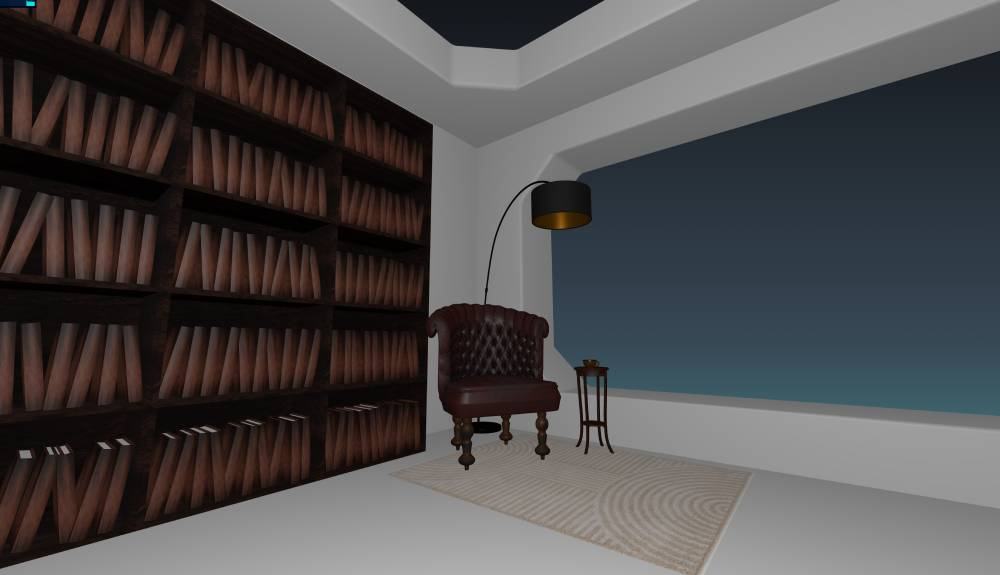

# Three.js Journey October 2025, Challenge 20: Cozy Place

For this challenge, I'll strive to update this blog post in addition to social posts on my progress.

*Updates:*

- [Oct 13 Modeling](#update-oct-13)
- Oct 13: [public link available](https://tjsj-cozy.web.app/)!
- Nov 4: 
    Well then... I have fallen behind on my updates. Today was the review day for October's challenge. [Let's finish the updates.](#update-nov-4)

## Brainstorming

With the theme being "Cozy Place," I began with brain dumping a lot of cozy place ideas: libraries, cozy reading nooks, big fluffy beds, etc. I briefly also considered how it could be made into a game, but then I remembered I'm a noob at this process and don't have 40 hours a week (or even half that probably) to dedicate to a month-long project. Gotta lock down that scope creep good and early.

I went to one of my go-tos for ideas: [Pinterest](https://pinterest.com). Although it's polluted these days with ads and AI-generated material, it's the AI-generated concept art that I find most helpful. I searched "cozy" and took it away from there. I also searched "cozy" synonyms, etymology, and definitions for branching and adjacent ideas.

I eventually came to a fun chat discussion with ChatGPT for idea iteration. I prompted it to spit out some ideas at the surface level for my consideration, then I added some fun curve balls like "give me more fantasy themes." That spun off into oblique sci-fi ideas. I also had it contrast ironic themes.

Ultimately, I ended on an idea that's very "me" as my wife quipped: a spaceship reading nook with books and shelves all around. The "cozy" theme is met with the comfy chair surrounded by books and beautiful nature scenery (i.e. background space scene). The irony came in with the dramatic contrast of being in a wildly hostile environment (space) with a cozy spot to read. The idea "cozy" implies safety, security, and warmth, all of which are antithetical to the dangerous, hostile cold of space. I love it.

## Composition

With my theme and idea refined, I set out to thumbnail composition ideas. I know it's going to be a chill, contemplative scene (like [my previous challenge](./threejs-journey-challenge19-aquarium) but less surreal).

I also know I *really* want to build a reusable system/function for gently adjusting the camera in Three.js based on my mouse movements. This would give some subtle interaction with the scene, but keep the user focused on the main "cozy place." I read a great article once for indie game devs suggesting they should build reusable systems instead of minigames as a way to learn. I'll post that here if I find the link again. It inspired me to isolate my own reusable systems for Three.js so projects like this go faster & smoother.

In my undergrad (Bachelor of Fine Arts in Digital Art), I learned the great value of forcing yourself to thumbnail ideas, especially when it comes to composition. The first 10 ideas are often pretty basic and common. Creativity usually comes when you push past your comfort zone and keep dreaming up ideas. I didn't do as many past 10, but that's when I started getting ideas I really liked. Unfortunately, some of those ideas are mighty ambitious for a new creative developer (i.e. Three.js and Blender are still new enough I can't stretch as far as I'd like).

I began asking myself, "which of these still captures 'cozy place'" with the elements I want but is practical given I might only have 6-8 hours a week to work on it?

(I've got to get my blog images under control. Good grief.)

In the middle row, you'll notice a star with 1, 2, and 3. While star 3 looks really cool, I wanted to tackle a room I was more confident in modeling first. The room needn't be flawless all around. The viewer will only catch this corner of it. However, it'll accomplish what I need.

## Modeling

I did a lot of work with Maya in my undergrad, and Blender shares many similarities with Maya, but they are very different too. I've tried learning Blender **many** times, but my muscle memory for navigating Maya has been so strong and my use cases so few that I've never really taken off with it. I know the controls can be configured to mirror Maya, but that messes with tutorials as I do them. I'd prefer to learn Blenders defaults.

I pulled up some Blender tutorials this time around and did a few demos on the side to get a feel for how to make complex models with a few simple commands. **Pro noob tip:** search for "N things I wish I knew in Blender" as a source for good tips.

I started this modeling approach (right or wrong) by making a rectangle/box and using the loop tool to add some edges I would preserve. I then inset and extruded until I got what looked like windows. I would *like* to get some glass/window textures in place for those so my cozy reading spot isn't exposed to the decompressing vacuum of the near-infinite void, but we'll get to that later.

I also hunted around until I found a great model (TODO give credit to model artist). I tweaked the size and orientation, then dropped it into my room, imported them into my code, *et voila*! I have a room corner with a chair!

### Update Oct 13

**I've expanded the modeling a lot.** I didn't like how the composition pinched the chair position, and I wanted taller shelves for my books than what the windows were allowing. I removed a window and threw a large book shelf with many books up. The Array modifier in Blender helped significantly with both the construction of the shelves *and* the multiplication of the books. (I created one book, used the Array mod to fill one shelf, then used the Array mod 2 more times to fill out each shelf along the X and Z axes [b/c Z is "up" in Blender]). I'd like to vary the book textures as a stretch goal, but this is sufficient for now.

I also added a rug to lighten up the scene (thanks [Wayfair](https://www.wayfair.com/rugs/pdp/ebern-designs-zuhur-area-rug-w110736589.html?piid=1967988449)); most of the objects are espresso, my favorite "wood color," or a dark leather. Additionally, a floor lamp was added behind the chair to also *lighten up the room*. Eh?? EHHH???? Okay, that's enough.

I just tonight (Oct 13) finished up adding a side table and hot drink mug. The mug is pretty low poly, but it's far enough away not to notice. Another stretch goal will be to get the scene just right, then start degrading the poly counts and see how far down I can tweak things to lighten the assets.

### Update Nov 4

Not much changed with the models by the end. My fake environment map (truthfully just a large sphere - sub par but sufficient for the time) was added with its beautiful texture. (Credits coming soon.)

One excellent adjustment per my lovely wife's suggestion was to rotate and enlarge the carpet to run in front of the book shelf. Solid advise and it looks much better that way. Admittedly, the right side of the scene seems a bit barren now, but that was acceptable given the view outside.

## Lighting

Lighting was finally improved, though not substantially. I tweaked the main point light, removed the ambient light, and used the background sphere's texture map as an environment map for the scene. That allowed me to emit some colors from the texture to improve the actual ambience.

I *did* try mimicking the light from the background sphere, which may have been easier if it were a true environment map. **I tried placing you spot lights at roughly equidistant locations aligned with the background's stars and rotating them in a group synced with the background sphere's rotation.** The main problem was with the room model, which is half a room (2 walls missing behind the camera) to reduce poly counts. However, that also meant extra light in the room from behind. This made the room prohibitively bright.

(Y'know, photos to illustrate my point would be great. I should add those...)

I ended up keeping my tweaked lights as they were. I tried adding shadows, but my model is weird in the corner and caused more shadow issues. Additionally, I wanted to avoid expensive shadow rendering all over, so I fake baked a shadow for under the chair and side table.

## Background Music

I added some chill background tunes (Erik Satie's "Gymnopédies"). After I added it, I discovered what "click gates" do for immersive scenes like this: user interaction. If audio loads without user interaction, the audio won't play (in some browsers) to avoid annoying autoplay music/sound.

By adding a "click gate" (overlay the user clicks to enter the scene), they implicitly opt in to playing audio. Of course, controls must be added for those wishing to silence the scene, which I added.

## Special Effects

One of my favorite parts (that also turned out to be quite fast thanks to [Three.js Journey's Cofee Smoke Shader lesson](https://threejs-journey.com/lessons/coffee-smoke-shader)) is my "hot drink" steam effect.

Funny story: I was only 2 lessons behind it in the Shaders section when I stumbled upon it via searching. I was tickled to discover the lesson was so close and I already had access!

It's not one of my favorite features and an inspiration for me to continue through an admittedly daunting section of Three.js Journey.

## Final Review

Bruno started the Twitch live stream, and it went on for 4 hours. The group was very chatty and easily distracted. I received great feedback though. Many notes were things I already wanted to do but ran out of time to implement. It encourages me I'm on the right wavelength.

One great tip from Bruno was to use an actual environment map for my sky in order to gain the emissive lighting (which includes colors) instead of my hacked approach. Apparently it's a new-ish feature in Three.js to spin the environment map, which I think I looked for but failed to find. I'll have to try again. I want to improve with environment maps and HRDI images (both using and creating my own).

One other note I overlooked was that my books relative to my drink cup are disproportionate to each other. So easy to miss those details, but I know their value from art projects and perspective drawings. Amazing how those lessons carry over.

**Overall**, I'm quite pleased with how it all turned out. I definitely want to improve the lighting and the room model, but the other details are sufficient for what the project is: another attempt to implement what I've been learning on this awesome Three.js Journey! 😃

[Check out the final project: Cosmic Cozy.](https://tjsj-cozy.web.app)