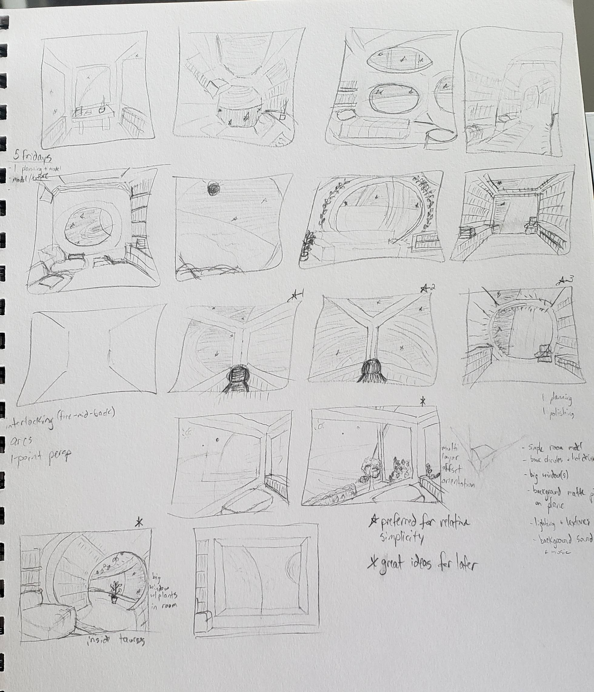
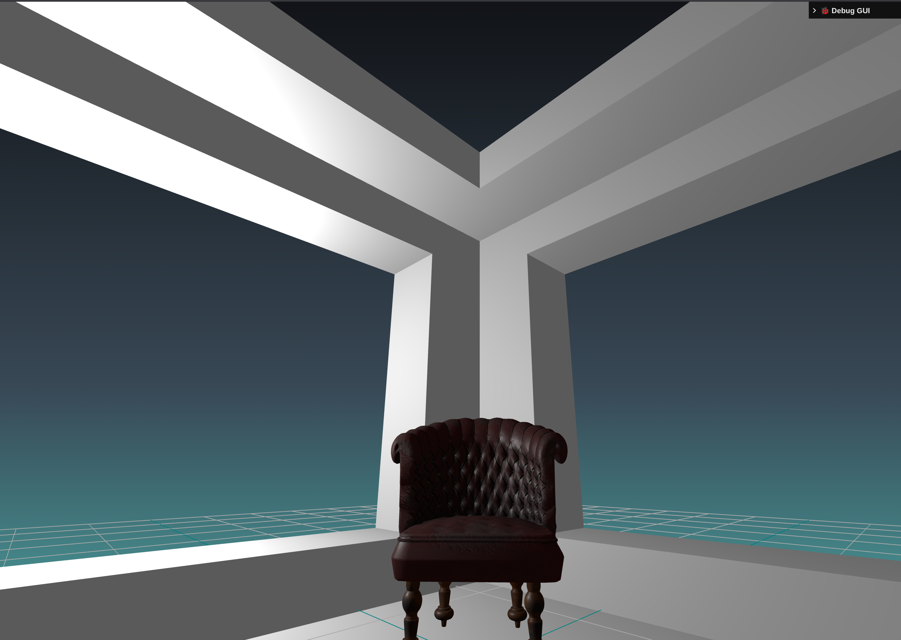

# Three.js Journey October 2025, Challenge 20: Cozy Place

For this challenge, I'll strive to update this blog post in addition to social posts on my progress.

## Brainstorming

With the theme being "Cozy Place," I began with brain dumping a lot of cozy place ideas: libraries, cozy reading nooks, big fluffy beds, etc. I briefly also considered how it could be made into a game, but then I remembered I'm a noob at this process and don't have 40 hours a week (or even half that probably) to dedicate to a month-long project. Gotta lock down that scope creep good and early.

I went to one of my go-tos for ideas: [Pinterest](https://pinterest.com). Although it's polluted these days with ads and AI-generated material, it's the AI-generated concept art that I find most helpful. I searched "cozy" and took it away from there. I also searched "cozy" synonyms, etymology, and definitions for branching and adjacent ideas.

I eventually came to a fun chat discussion with ChatGPT for idea iteration. I prompted it to spit out some ideas at the surface level for my consideration, then I added some fun curve balls like "give me more fantasy themes." That spun off into oblique sci-fi ideas. I also had it contrast ironic themes.

Ultimately, I ended on an idea that's very "me" as my wife quipped: a spaceship reading nook with books and shelves all around. The "cozy" theme is met with the comfy chair surrounded by books and beautiful nature scenery (i.e. background space scene). The irony came in with the dramatic contrast of being in a wildly hostile environment (space) with a cozy spot to read. The idea "cozy" implies safety, security, and warmth, all of which are antithetical to the dangerous, hostile cold of space. I love it.

## Composition

With my theme and idea refined, I set out to thumbnail composition ideas. I know it's going to be a chill, contemplative scene (like [my previous challenge](./threejs-journey-challenge19-aquarium) but less surreal).

I also know I *really* want to build a reusable system/function for gently adjusting the camera in Three.js based on my mouse movements. This would give some subtle interaction with the scene, but keep the user focused on the main "cozy place." I read a great article once for indie game devs suggesting they should build reusable systems instead of minigames as a way to learn. I'll post that here if I find the link again. It inspired me to isolate my own reusable systems for Three.js so projects like this go faster & smoother.

In my undergrad (Bachelor of Fine Arts in Digital Art), I learned the great value of forcing yourself to thumbnail ideas, especially when it comes to composition. The first 10 ideas are often pretty basic and common. Creativity usually comes when you push past your comfort zone and keep dreaming up ideas. I didn't do as many past 10, but that's when I started getting ideas I really liked. Unfortunately, some of those ideas are mighty ambitious for a new creative developer (i.e. Three.js and Blender are still new enough I can't stretch as far as I'd like).

I began asking myself, "which of these still captures 'cozy place'" with the elements I want but is practical given I might only have 6-8 hours a week to work on it?

(I've got to get my blog images under control. Good grief.)

In the middle row, you'll notice a star with 1, 2, and 3. While star 3 looks really cool, I wanted to tackle a room I was more confident in modeling first. The room needn't be flawless all around. The viewer will only catch this corner of it. However, it'll accomplish what I need.

## Modeling

I did a lot of work with Maya in my undergrad, and Blender shares many similarities with Maya, but they are very different too. I've tried learning Blender **many** times, but my muscle memory for navigating Maya has been so strong and my use cases so few that I've never really taken off with it. I know the controls can be configured to mirror Maya, but that messes with tutorials as I do them. I'd prefer to learn Blenders defaults.

I pulled up some Blender tutorials this time around and did a few demos on the side to get a feel for how to make complex models with a few simple commands. **Pro noob tip:** search for "N things I wish I knew in Blender" as a source for good tips.

I started this modeling approach (right or wrong) by making a rectangle/box and using the loop tool to add some edges I would preserve. I then inset and extruded until I got what looked like windows. I would *like* to get some glass/window textures in place for those so my cozy reading spot isn't exposed to the decompressing vacuum of the near-infinite void, but we'll get to that later.

I also hunted around until I found a great model (TODO give credit to model artist). I tweaked the size and orientation, then dropped it into my room, imported them into my code, *et voila*! I have a room corner with a chair!

## Pending Conclusion

That's the progress so far! A room and a chair. Not a bad start, I think. At least it's a start. More updates to come!